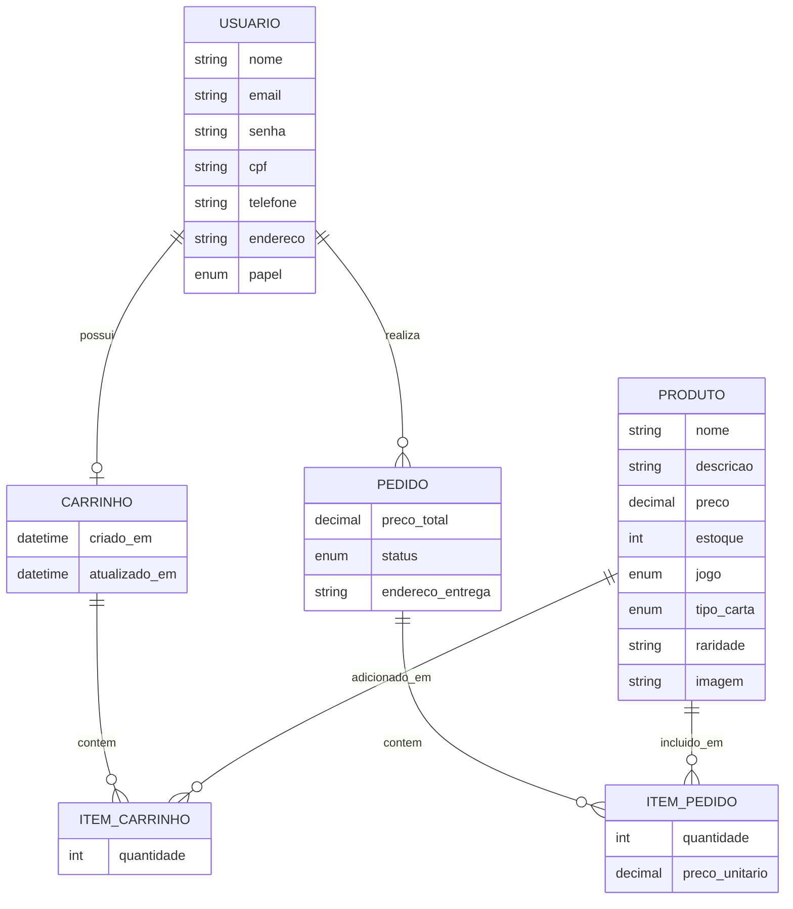
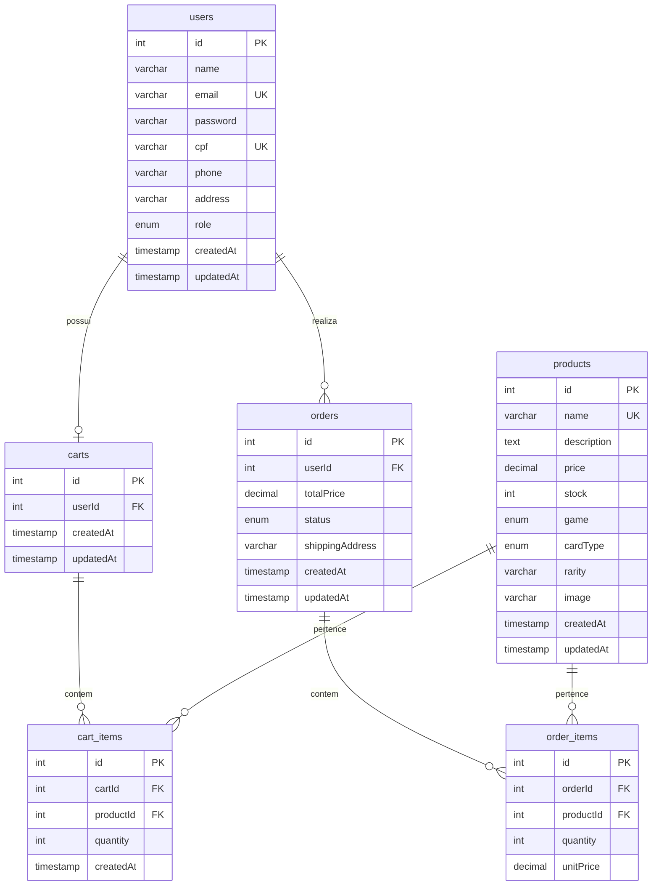
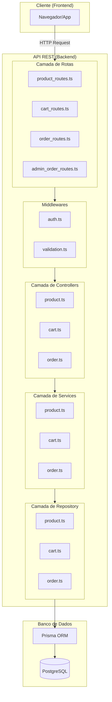
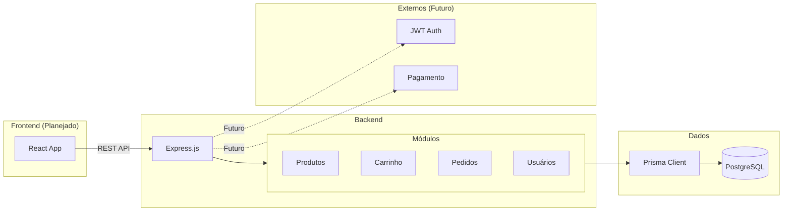
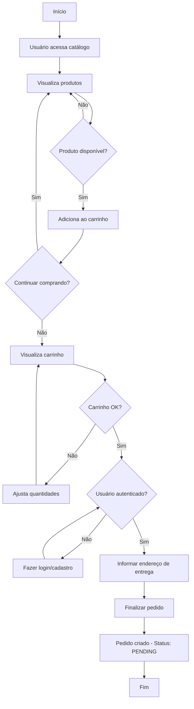
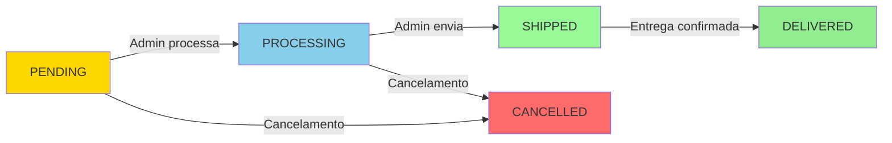
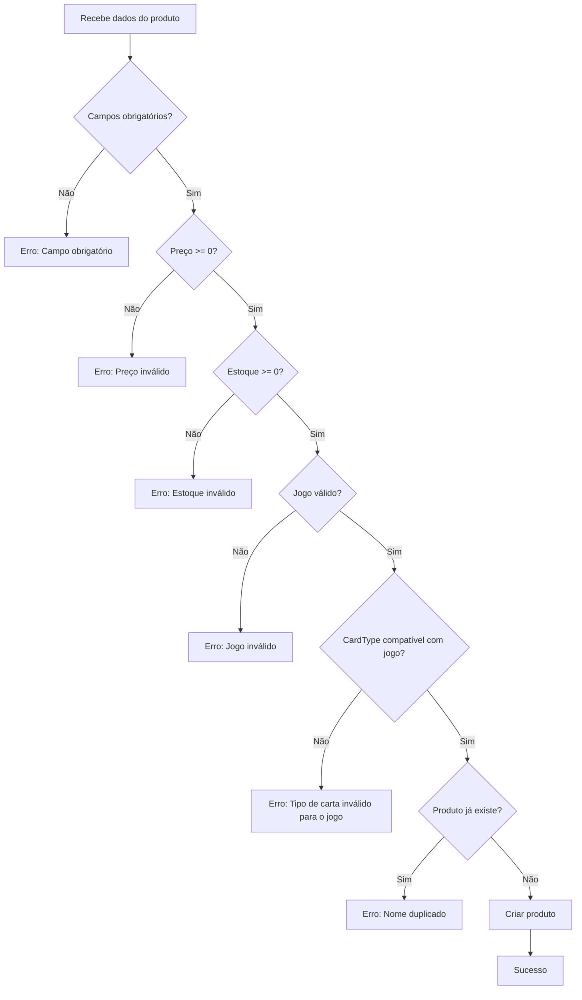
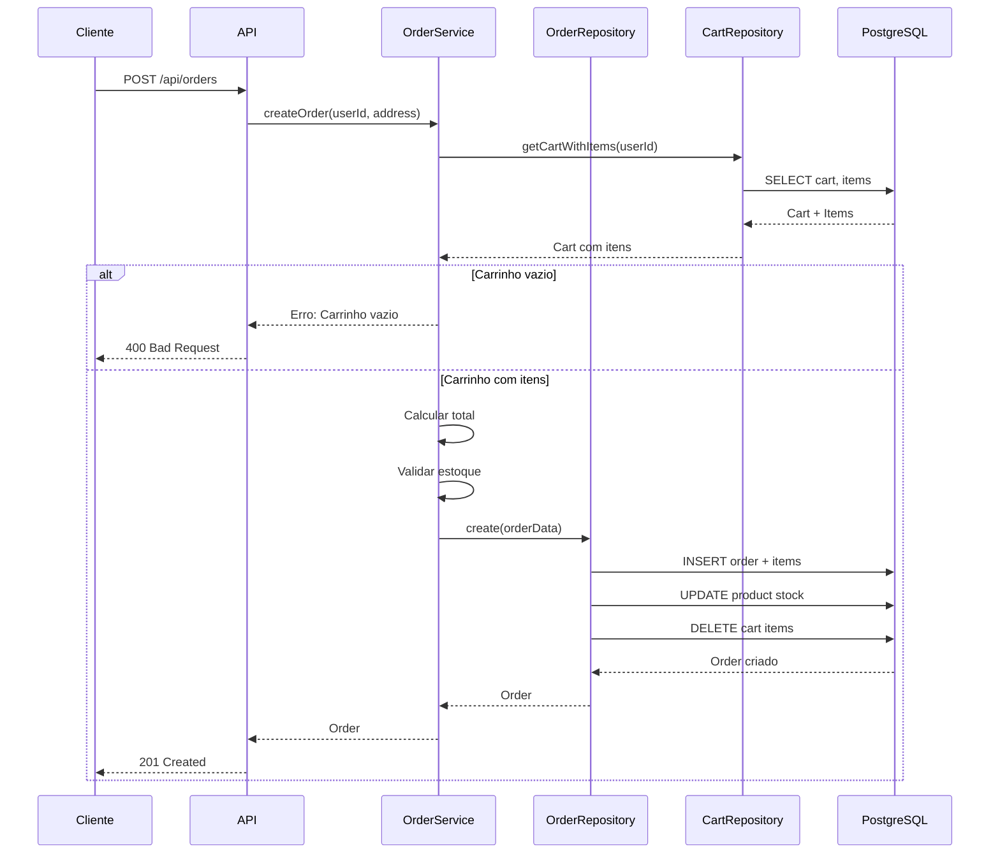
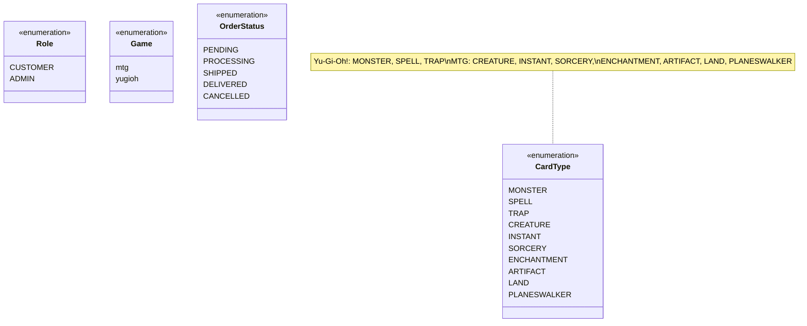
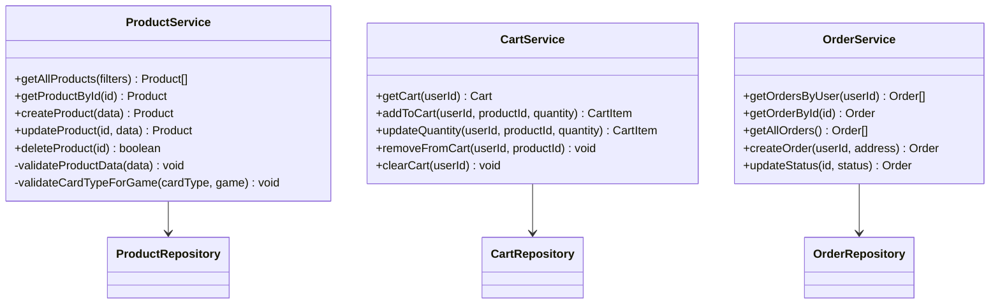

# Diagramas do CardShop

## 1. Modelo Entidade Relacionamento (MER) - Conceitual

## 2. Diagrama Entidade Relacionamento (DER) - Físico

**Legenda dos Enums:**
- `role`: CUSTOMER, ADMIN
- `game`: mtg, yugioh
- `cardType`: MONSTER, SPELL, TRAP (Yu-Gi-Oh!) / CREATURE, INSTANT, SORCERY, ENCHANTMENT, ARTIFACT, LAND, PLANESWALKER (MTG)
- `status`: PENDING, PROCESSING, SHIPPED, DELIVERED, CANCELLED

## 3. Diagrama de Arquitetura - N-Tier

## 4. Diagrama de Arquitetura - Componentes

## 5. Fluxograma - Processo de Compra

## 6. Fluxograma - Ciclo de Vida do Pedido

## 7. Fluxograma - Validação de Produto

## 8. Diagrama de Sequência - Criar Pedido

## 9. Modelo de Dados - Enums

## 10. Diagrama de Classes - Camada de Services

